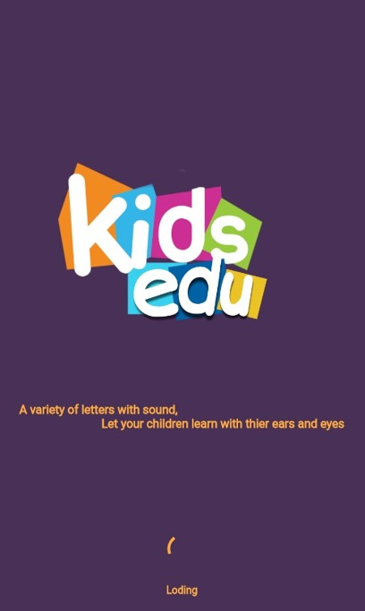
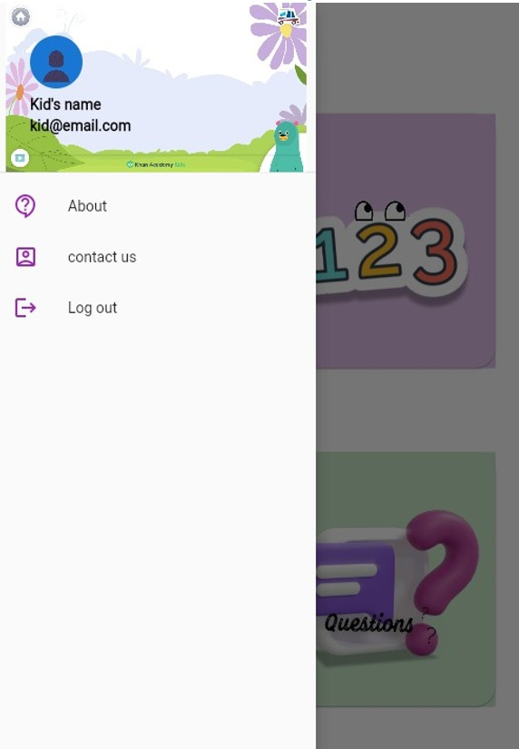
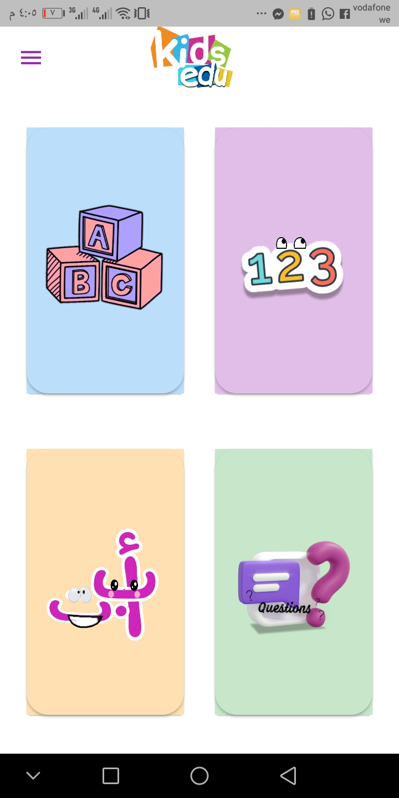
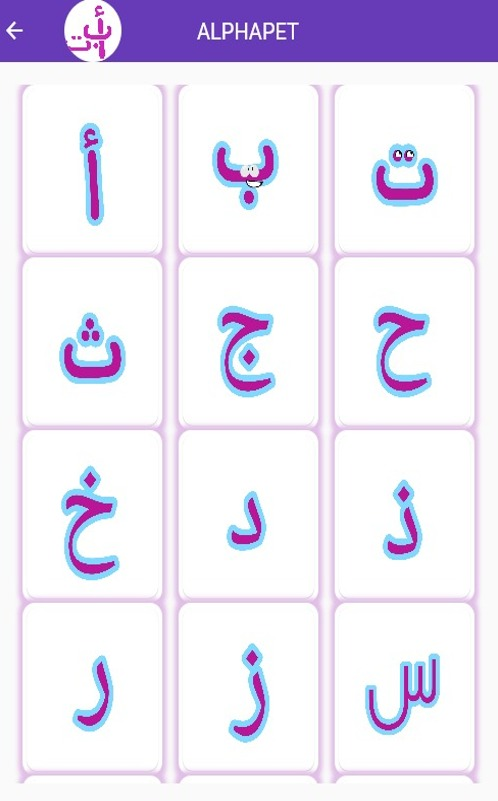
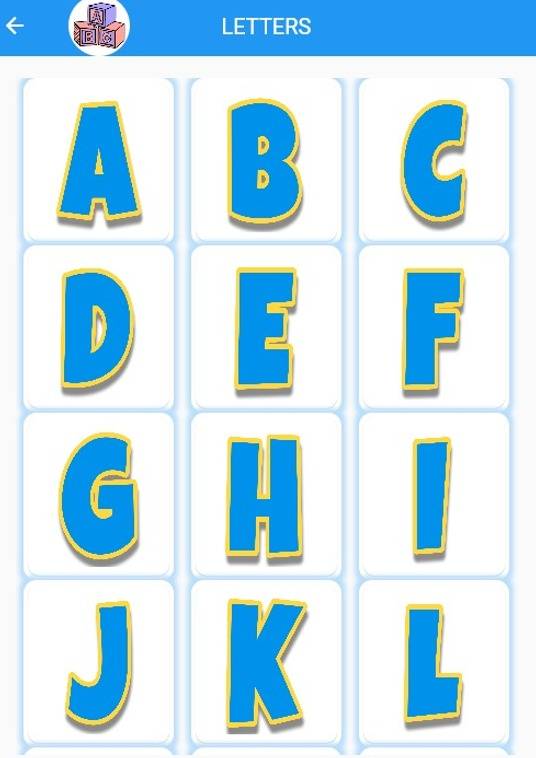
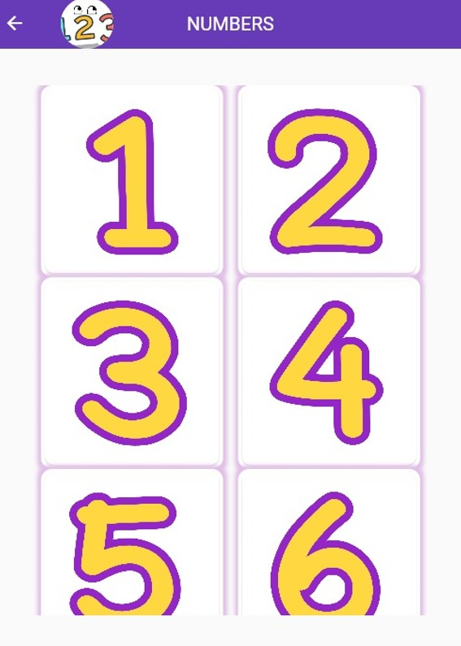

# 👶🔠 KIDSedu - Education app for kids

An application to teach children the letters and numbers to pronounce and write them using sounds and arithmetic questions to facilitate learning for children.

Don't forget to star⭐ the repo if you like what you see😉.

   ## Project Status
   _Complete_
   
# 📸 Screenshots
The screenshots below are taken on a android emulator.

| 1 | 2|
|------|-------|
|||

| 3 | 4|
|------|-------|
|||

| 5 |  6|
|------|-------|
|||

| 7 |  8|
|------|-------|
|||

   
   ## Contact
Created by [@Nour Nabil](https://www.linkedin.com/in/nour-nabil-615330217/) - feel free to contact me!
